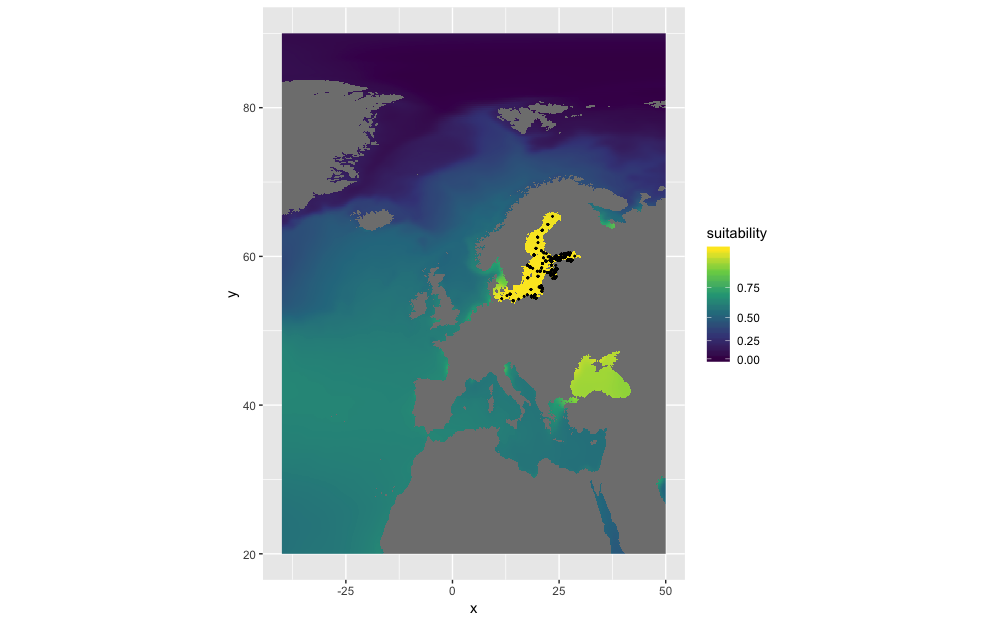

# findingdemo

Sea Invaders provides recreational divers with a 'most wanted' list of invasive species! Based on their location, the service compiles a list of known troublemakers that are most likely to start invading their favourite diving spot. The risk of invasion by given species is based on local habitat suitability and distance to the nearest occurrence. This citizen science tool lets the diving community know what species they need to look out for and acts as a network of early detection for invasive species across Europe.

## How to
#### Fetch WRiMS species list

```r
sp <- get_wrims_species
```

#### Fetch temperature and salinity raster data

```r
temp <- get_temperature()
sal <- get_salinity()
```

#### Extract raster data

```r
t <- extract_raster(temp, 0, 55)
```

#### Fetch occurrence data for an AphiaID

```r
occ <- get_occurrence(159559)
```

#### Create habitat suitability maps

```r
occ <- get_occurrence(234025)
temp <- get_biooracle_temperature()
sal <- get_biooracle_salinity()

plot_niche(occ, temp, sal)
hs <- make_suitability(occ, temp, sal)

df <- as.data.frame(hs, xy = TRUE)
ggplot() +
    geom_raster(data = df, aes(x = x, y = y, fill = suitability)) +
    scale_fill_viridis_c(trans = "exp") +
    coord_quickmap() +
    geom_point(data = occ, aes(x = longitude, y = latitude), size = 0.3)
```



#### Launch shiny app

```r
launch_app()
```

#### Create distance raster

```r
d <- get_distance_raster(occ = occ, res = 1000)
plot(d)
```

## Test species

```
107451 Eriocheir sinensis
129884 Heteromastus filiformis
144476 Caulerpa taxifolia
138963 Crepidula fornicata
876640 Ensis leei
140416 Rapana venosa
233889 Paralithodes camtschaticus
160585 Heterosigma akashiwo
103732 Ciona intestinalis
232032 Rhopilema nomadica
106362 Beroe ovata
102296 Gammarus tigrinus
126916 Neogobius melanostomus
421139 Amphibalanus improvisus
234025 Cercopagis (Cercopagis) pengoi
```
